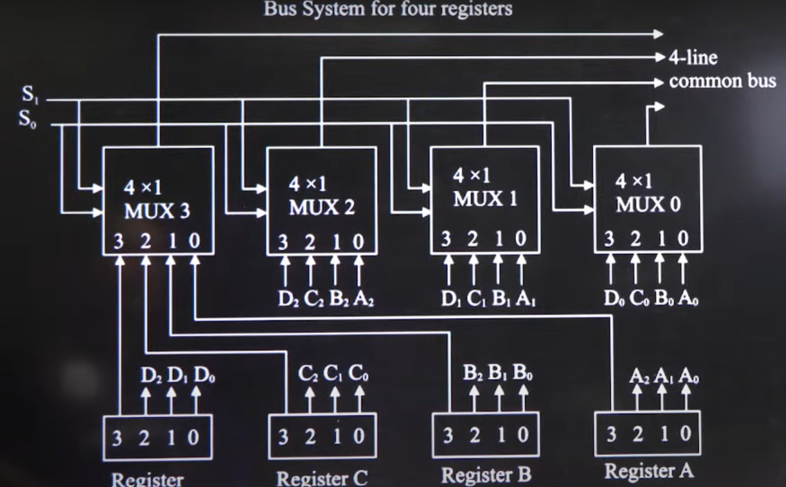

# ALU Data Path

## How Data is Transferred

Suppose a data transfer $R_A \rightarrow R_B$

1. The select line will be `00`, which represents Register A

    - $R_{A_{out}}$ will be activated by the `MMU`

    - $R_A$ 0 to 3 will be sent to $MUX_A$ 0 to 3

2. From the Multiplexers, the data will move to the internal bus

    - There will be four lines in the internal bus

    - The MUX will select the appropriate data type based on control signals

3. From the internal bus, the data will move back to the multiplexers

    - The data will move from `S` 1 to 4, to $MUX_B$ 0 to 3

4. From the multiplexers, the data will move to Register B (`01`)

    - The data will move from $MUX_B$ 0 to 3, to $R_B$ 0 to 3
