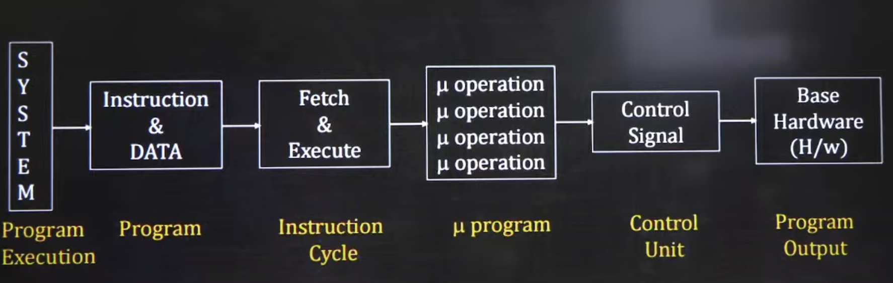

# Control Unit Design

- CU is the supervisor of the system as it controls all activities

- It generates control signals and activates the interrupt service

- These control signals are required to execute the micro-operations

- These signals are directly executed on the hardware

